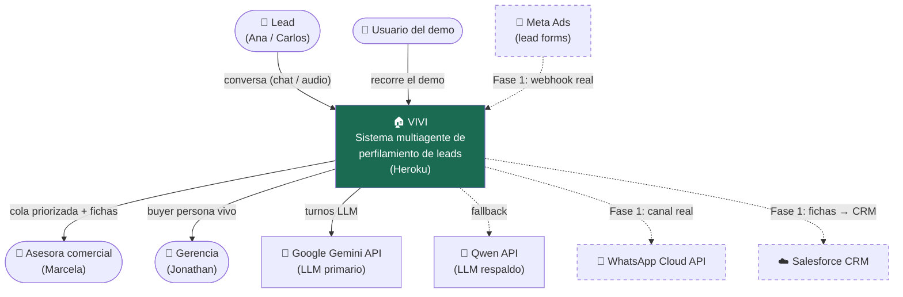
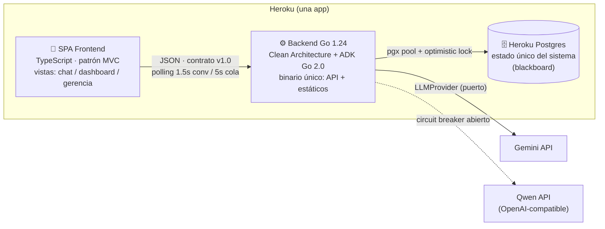
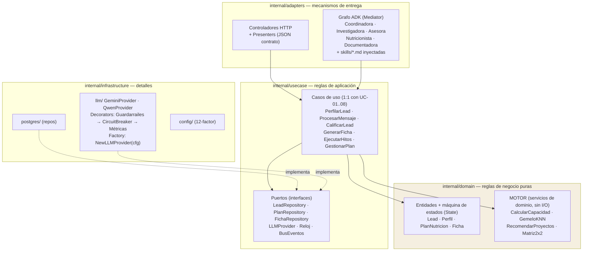
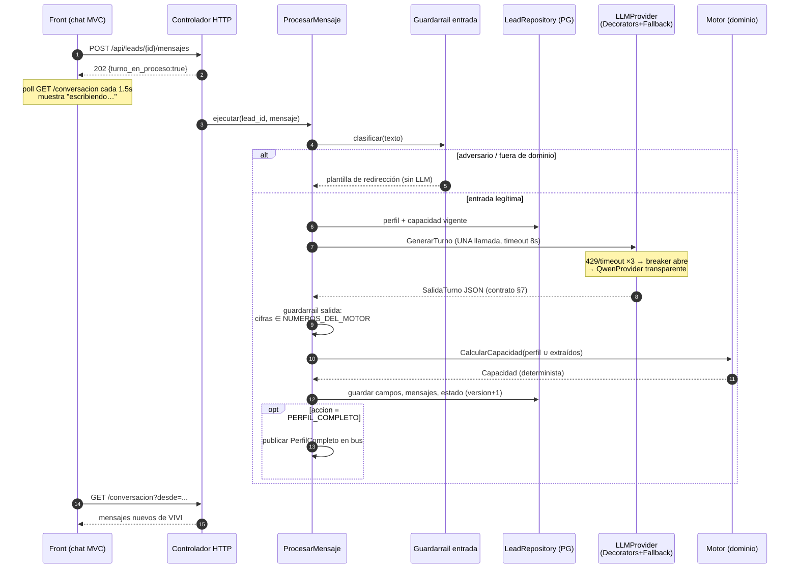
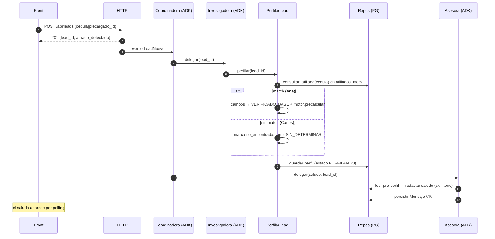
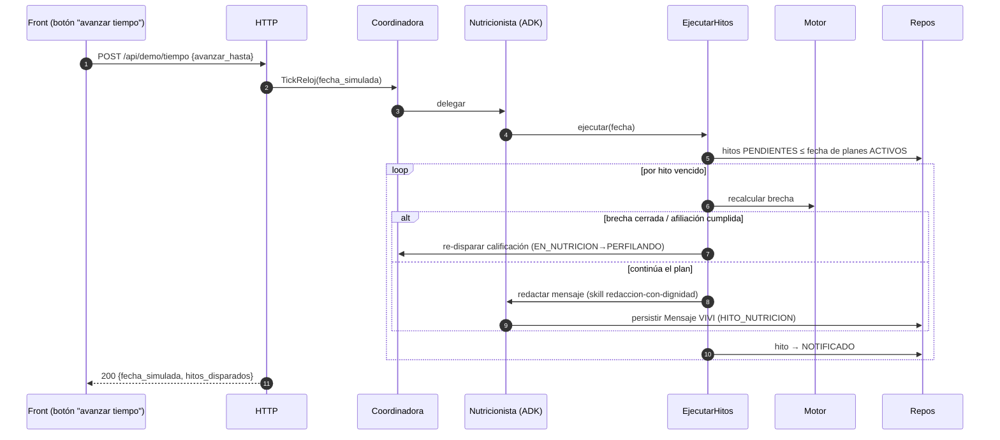

# Arquitectura de Software — Vivi · Fase 0

Este documento transcribe los niveles C4 1–3 y los flujos críticos de la arquitectura de Fase 0. Los diagramas Mermaid se conservan para renderizado nativo en GitHub.

> **Fuente:** `11‐Arquitectura-de-Software-—-Vivi-·-Fase-0.md`, Wiki de Vivi. Se transcriben sus secciones 1–4; las secciones de estado, despliegue y ADR quedan fuera de este slice documental.

## 1. C4 — Nivel 1: Contexto

Línea punteada = fuera de Fase 0 (adaptadores previstos, no implementados). En Fase 0 el "lead form de Meta" se simula con `POST /api/leads` y el canal WhatsApp con el chat web (más sandbox Twilio solo para el video).

## 2. C4 — Nivel 2: Contenedores

El backend sirve los estáticos del front compilado (un solo dyno, cero CORS). Toda comunicación front↔back es el contrato `10-contratos.md`; el front jamás toca la BD ni los LLM.

## 3. C4 — Nivel 3: Componentes del backend (capas Clean)

**Regla de dependencia (verificada en CI con lint de imports):** las flechas solo apuntan hacia adentro. `domain` no importa nada; `usecase` solo importa `domain`; `adapters` e `infrastructure` importan hacia adentro y nunca entre sí. El grafo ADK vive en adapters porque es mecanismo de orquestación/entrega, no regla de negocio: sus tools delegan en casos de uso.

## 4. Diagramas de secuencia (flujos críticos)

### 4.1 Turno conversacional (el flujo del presupuesto <3s, NFR-R-01)

### 4.2 Lead nuevo → saludo personalizado (UC-01 pasos 1–5)

### 4.3 TickReloj → hito de nutrición (UC-07)

