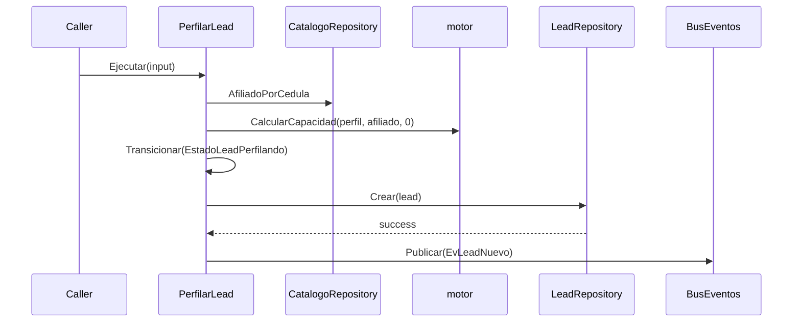

# Design: Deterministic PerfilarLead (Issue #18)

## Technical Approach

Add one synchronous, provider-free application service in `internal/usecase`. It creates the lead, enriches only Contract-recognized profile keys from the affiliate snapshot, delegates all money to `motor.CalcularCapacidad(profile, affiliate, 0)`, performs `NUEVO → PERFILANDO` through the domain state machine, persists, then publishes `LeadNuevo`. Family re-consultation loads and CAS-saves the existing lead. Catalog/kNN candidate selection is explicitly excluded: Issue #18 needs pre-calculation only and the motor already applies the 195,000,000 median fallback for candidate price `0`.

## Architecture Decisions

| Decision | Choice and rationale | Rejected alternative |
|---|---|---|
| Boundary | `PerfilarLead` depends only on existing usecase ports plus domain/motor; preserves NFR-M-01. | HTTP, ADK, Postgres, LLM, greeting, or messaging orchestration. |
| Monetary API | Call the real three-argument `CalcularCapacidad(profile, lead.Afiliado, 0)` for initial and family flows; `hogar_con_afiliado` supplies family eligibility. | Stale `ParametrosCredito`, hard-coded rates, catalog/kNN candidate selection. |
| Profile vocabulary | Private string constants must belong to `domain.CamposReconocidos`: `ingreso_hogar`, `categoria`, `segmento`, `personas_hogar`, `tipo_hogar`, `tiene_vivienda`, `recibio_subsidio`, `hogar_con_afiliado`, `cedula_familiar_afiliado`. | Inventing `no_encontrado` or `empresa_piramide` profile keys. |
| Provenance | Active affiliate fields use `domain.FuenteCampoVerificadoBase`, confidence `1`; `personas_hogar=PersonasACargo+1`. Synthetic-demo hits also stamp eligibility baseline `tiene_vivienda=false`, `recibio_subsidio=false`. | Treating declared/inferred facts as verified outside the approved demo baseline. |
| Family idempotency | A repeated verified cedula is a no-op; a second distinct verified cedula returns `ErrFamiliarYaRegistrado` unchanged. This prevents double income while the Contract has one singular cedula field. | Re-adding income or replacing the sole audit key. |
| Commit/event order | Compute and transition in memory, `Crear`, then publish `EvLeadNuevo`; family saves emit no lifecycle event. | Publishing before persistence or misusing `EvPerfilCompleto`. |

## Data Flow



Family flow is `PorID → duplicate guard → AfiliadoPorCedula → mutate/recalculate → Guardar`. Unknown/inactive family or non-context lookup failure writes `cedula_familiar_afiliado` as `FuenteCampoDeclarado`, confidence `0.5`, `RequiereConfirmacion=true`; context cancellation/deadline returns before mutation, and successful save precedes `ErrFamiliarNoEncontrado`.

## Interfaces / Contracts

```go
type EntradaPerfilar struct { Nombre, Telefono, Cedula, Fuente string }
type SalidaPerfilar struct {
    LeadID string
    Estado domain.EstadoLead
    AfiliadoDetectado bool
}
type PerfilarLead struct {
    Leads LeadRepository; Catalogo CatalogoRepository
    IDs GeneradorID; Bus BusEventos; Reloj Reloj
}
func (uc *PerfilarLead) Ejecutar(context.Context, EntradaPerfilar) (SalidaPerfilar, error)
func (uc *PerfilarLead) ReconsultarPorFamiliar(context.Context, string, string) error
var ErrFamiliarNoEncontrado, ErrFamiliarYaRegistrado error
```

`Ejecutar` initializes a non-nil `domain.Perfil`, `domain.EstadoLeadNuevo`, timestamps from `Reloj`, and an opaque ID. Missing, inactive, empty-cedula, or non-context catalog failure degrades to `Afiliado=false` with an empty profile; output/event state carries the result without an unrecognized key. `context.Canceled` or `context.DeadlineExceeded` returns before capacity, create, or event. Transition or `Crear` error returns wrapped and publishes nothing. `BusEventos.Publicar` has no error channel.

`ReconsultarPorFamiliar` returns `PorID` and context errors before mutation. On unknown family, `Guardar` failure takes precedence over `ErrFamiliarNoEncontrado`. On a hit, it verifies family keys, adds income once to existing `ingreso_hogar`, recalculates, and CAS-saves; `Guardar` errors propagate and no event is emitted.

## File Changes

| File | Action | Description |
|---|---|---|
| `internal/usecase/perfilar_lead.go` | Create | DTOs, orchestration, mapping, duplicate guards, errors. |
| `internal/usecase/perfilar_lead_test.go` | Create | Deterministic usecase tests and local catalog/bus fakes. |
| Existing ports/domain/motor/fakes | Read only | Consume current contracts unchanged. |

## Testing Strategy

Use table-driven package tests with fixed time and `NuevoLeadRepoFake()`, `NuevoRelojFake(fixed)`, `NuevoIDFake("lead")`; implement only local interface-complete catalog/bus fakes. Prove: active Ana yields verified mapping, subsidy `52527150`, `PERFILANDO`, version `1`, and exactly one post-create event; miss/inactive/error yields empty profile and zero subsidy; create failure emits no event; family hit adds once, repeat is a no-op, distinct verified family is rejected; unknown family persists declaration before sentinel; CAS/save failure dominates and leaves storage unchanged. Run focused tests, then `go test ./...`, `go build ./...`, `go vet ./...`, and `gofmt -l`.

## Threat Matrix

N/A — no routing, shell, subprocess, VCS/PR automation, executable classification, or process-integration boundary.

## Delivery, Rollback, and Risks

Forecast: ~155 production + ~205 test lines = ~360 authored implementation/test lines, one PR to `main`, below 400. No migration or rollout flag. Roll back by reverting/deleting the two new files; no wiring imports them. Residual risks: demo eligibility provenance is synthetic, and non-context catalog failures intentionally degrade to a non-affiliate/unknown-family path while cancellation/deadline propagates.

## Open Questions

None blocking; the single verified-family guard follows the Contract’s singular field and prevents unsupported accumulation.
