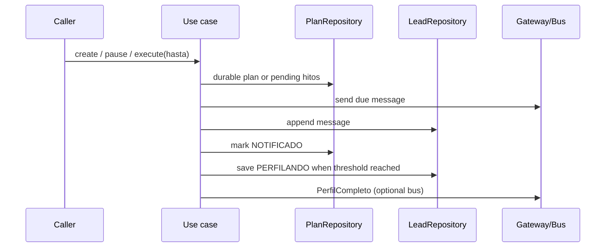

# Design: Nutrition Plan with Explicit Consent and Time Advancement

## Technical Approach

Add a pure milestone planner and two callable application services over existing ports. No HTTP, ADK, event subscription, clock implementation, schema, Contract, or existing use-case change is included. Contract v1.1 names/types win over Issue #21 snippets: use `domain.TipoHito*`, `domain.EstadoHito*`, and `domain.EventoCalendario.Fecha string`. Current `CalificarLead` already persists route `NUTRICION` as `EN_NUTRICION`; creation therefore treats that state as normal instead of repeating an illegal transition.

## Architecture Decisions

| Decision | Choice and rationale | Rejected |
|---|---|---|
| Calculation boundary | `motor.DisenarHitos` is pure; use cases own IDs, repositories, clock, and messages. This preserves Clean Architecture and auditability. | LLM/agent-generated dates or amounts. |
| Goal input | Caller supplies `PrecioObjetivo`; `brecha=max(0, PrecioObjetivo-lead.Capacidad.PresupuestoMax)`. Persist only existing `MetaMonto/MetaDescripcion`. | Deriving a project or adding Contract fields. |
| Delivery semantics | Persist/send in explicit order and aggregate per-hito failures with `errors.Join`; the next tick retries pending milestones. | Cross-repository transaction or hidden retry loop. |
| Integration | Expose callable services only. Publish only the existing `PerfilCompleto` handoff after durable lead save. | Subscribing to `TickReloj`, publishing `RutaDecidida`, or invoking `CalificarLead`. |

## Component APIs and Deterministic Rules

```go
func motor.DisenarHitos(brecha int64, convertible bool, desde time.Time,
    calendario []domain.EventoCalendario) []domain.Hito

type EntradaCrearPlan struct {
    LeadID string; Consintio bool; Frecuencia string; PrecioObjetivo int64
}
type GestionarPlan struct {
    Leads LeadRepository; Planes PlanRepository; Reloj Reloj; IDs GeneradorID
    Calendario []domain.EventoCalendario
}
func (*GestionarPlan) CrearPlan(context.Context, EntradaCrearPlan) (*domain.PlanNutricion, error)
func (*GestionarPlan) PausarPlan(context.Context, string) error

type EjecutarHitos struct {
    Leads LeadRepository; Planes PlanRepository; Gateway MensajeriaGateway
    Reloj Reloj; IDs GeneradorID; Bus BusEventos
}
func (*EjecutarHitos) Ejecutar(context.Context, time.Time) (int, error)
```

`CrearPlan` accepts only `QUINCENAL|MENSUAL|TRIMESTRAL`, a nonblank ID, positive target, nonnil capacity, route `NUTRICION`, and state `EN_NUTRICION` (or legacy `CALIFICADO` reconciliation). No consent appends exactly one door-open message for that call and returns `(nil,nil)` without plan/state writes; append failure is returned.

The planner clamps negative gaps to zero. If convertible, it first appends `AFILIACION` at UTC date `desde+8` days. It expands canonical `--MM-DD` CESANTIAS/PRIMA entries into concrete dates on/after `desde` for other leads, or strictly after the `AFILIACION` date for convertible leads, sorts date then source order, and takes up to four candidates strictly before the final reevaluation date. For each while remainder is positive: `aporte=restante/2`; if `<500000`, use all remaining; append a pending monetary hito and subtract. It finally appends `REEVALUACION` at `desde.AddDate(1,0,0)`. Dates are `YYYY-MM-DD`; IDs are assigned in returned order. Frequency is validated/persisted, not used to invent dates absent from the canonical calendar.

## State, Persistence, and Error Ordering



Create order is `PorLead` retry lookup → `Planes.Crear` → optional legacy lead transition/save. A retry after lead-save failure reuses the existing plan. Pause order is plan `PAUSADO` save → lead transition/save → one farewell append; missing plan and already-paused lead are idempotent success. Partial failures remain paused and return the error.

Execution rejects backward time, calls `Reloj.Avanzar(hasta)`, then queries active/pending due hitos. Per hito: `Gateway.Enviar` → `Leads.AgregarMensaje` → `Planes.MarcarHito(NOTIFICADO)`. Failure skips later steps for that hito, continues others, and counts only fully marked deliveries. Send-without-append may be delivered again next tick (at-least-once boundary). After marking, cumulative notified amounts reaching `MetaMonto`, or `REEVALUACION`, causes `EN_NUTRICION→PERFILANDO`, lead save, then at most one `PerfilCompleto` per lead/tick; nil bus is a no-op. Text is deterministic, ends with the pause option, and excludes distress presumptions.

## File Changes and Chained Delivery

| Slice | Files | Budget / rollback |
|---|---|---|
| 1 | Create `internal/domain/motor/plan.go`, `plan_test.go`, `internal/usecase/gestionar_plan.go`, `gestionar_plan_test.go` (creation only) | 330–385 lines; revert slice 1. |
| 2 | Modify `gestionar_plan.go/test.go` for pause; create `ejecutar_hitos.go`, `ejecutar_hitos_test.go` | 325–390 lines; child PR targets slice 1; revert slice 2 independently. |

No files are deleted; use nutrition-local fakes to avoid broad fake refactors.

## Testing Strategy

Table-driven planner tests cover rollover, ordering, conversion-first, zero/odd/small gaps, and immutable inputs. Use-case tests cover consent/frequency validation, existing-plan retry, current/legacy states, pause idempotency, forward clock, paused silence, each send/append/mark failure, continued processing, dignified copy, threshold handoff, one event, and nil bus. Run `go test ./internal/domain/motor/... ./internal/usecase/...`; runtime harness is N/A because wiring is intentionally deferred.

## Threat Matrix

N/A — no routing, shell, subprocess, VCS/PR automation, executable classification, or process-integration boundary changes.

## Rollout and Risks

Additive rollout; no migration or feature flag. Main residual risks are duplicate outbound delivery after partial failure (gateway has no idempotency contract) and non-atomic plan/lead writes; explicit ordering and retry tests bound both. No open Contract question remains.
