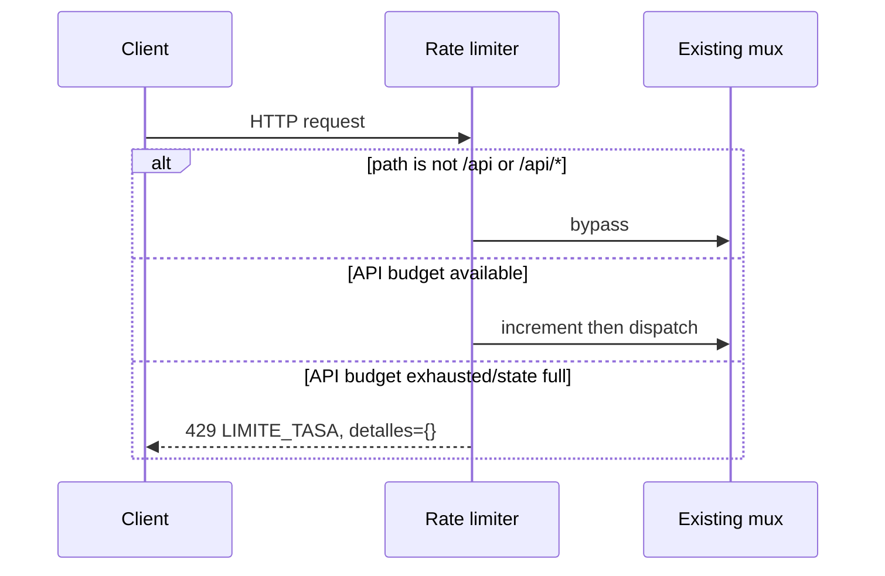

# Design: Issue 31 NFR Hardening

## Technical Approach

Wrap the fully registered `http.ServeMux` once at `http.Server.Handler` with a process-local, concurrency-safe fixed-window limiter. Only `/api` and `/api/*` are limited; `/salud` and all static/browser paths bypass it. Preserve the existing handlers and public `LIMITE_TASA` contract. Add a loopback-guarded k6 harness and reader-first repository documentation; make no CI, provider, database, Contract, or deployment changes.

## Architecture Decisions

| Decision | Choice and rationale | Rejected |
|---|---|---|
| Enforcement boundary | Outer middleware after API/static registration: one auditable policy and no handler duplication. | Per-handler checks; provider limiter reuse. |
| Client identity | Canonical `RemoteAddr` via `net/netip`; ignore forwarded headers unless the direct peer is in configured trusted CIDRs. For trusted peers, prefer `Forwarded`, otherwise `X-Forwarded-For`, walk right-to-left to the first untrusted address; malformed/ambiguous input falls back to the direct peer. | Trusting caller headers; `X-Real-IP`. |
| Window/state | 30 accepted API requests per identity in a 60-second window beginning at its first accepted request; reset when `now >= start+60s`. Mutex-protected map, injected clock, hard default capacity 4096, opportunistic expiry. At capacity, purge expired entries; if still full, deny a new identity without insertion. This bounds memory and fails closed. | Unbounded map, background goroutine, distributed store. |
| Load/docs | k6 is manual and loopback-only; 429 is expected for the limited API route but other 4xx/5xx fail thresholds. Docs lead with the quick path and verification tables. | Production probing, CI k6, inferred Wiki content. |

## Data Flow

Configuration errors (malformed trusted CIDR) stop startup. Request header parse errors never widen trust. Rejection does not call the downstream handler and never emits identity, header, or configuration data.

## File Changes

| File | Action | Description |
|---|---|---|
| `internal/adapters/http/ratelimit.go` | Create | Classifier, identity resolver, fixed-window state, `ErrLimiteTasaHTTP`. |
| `internal/adapters/http/ratelimit_test.go` | Create | Table-driven `httptest` and fake-clock/race cases. |
| `internal/adapters/http/errores.go` | Modify | Map the sentinel through existing 429 `LIMITE_TASA`. |
| `internal/infrastructure/config/config.go` | Modify | Parse optional comma-separated `TRUSTED_PROXY_CIDRS`; empty default, malformed value fails. |
| `internal/infrastructure/config/config_test.go` | Modify | Empty, valid, and malformed CIDR cases. |
| `cmd/servidor/main.go` | Modify | Pass trusted prefixes and wrap `mux`; no route/call-site changes. |
| `.env.example` | Modify | Document empty safe proxy default. |
| `tests/carga/endpoints.js` | Create | 100 req/s constant-arrival-rate for 60s, alternating `GET /salud` and `GET /api/leads`; p95 <300 ms, unexpected failure rate <1%. |
| `tests/carga/README.md` | Create | Pinned k6/Docker command and measured p95, throughput, machine template. |
| `README.md` | Modify | At-most-five-command quickstart, RF-to-package table, limiter/local-load limits. |
| `docs/arquitectura.md` | Create | Mermaid C4 L1-L3 and sequences transcribed from Wiki doc 11. |

## Interfaces / Contracts

`NuevoLimitadorTasa(next http.Handler, trusted []netip.Prefix) http.Handler` uses fixed policy defaults; a package-private constructor accepts `now func() time.Time` and capacity for deterministic tests. Public denial remains exactly HTTP 429 with `error.codigo="LIMITE_TASA"`, catalog message, and empty `detalles`; no `Retry-After`.

The k6 guard defaults to `http://127.0.0.1:8080` and accepts only `http` URLs whose hostname is exactly `localhost`, `127.0.0.1`, or `::1`, with no credentials. Validation occurs before any request. It calls only the two named no-LLM GET routes and treats API 429 as expected, not as an unexpected failure.

## Testing Strategy

| Layer | Evidence |
|---|---|
| Unit | 1–30 pass, 31st rejected without downstream call, exact +60s reset; per-IP isolation; IPv4-mapped normalization; untrusted spoof ignored; trusted chain selection; malformed chain fallback; cap never exceeded and expired entries reclaimed. |
| HTTP | 50 `/salud` and static GETs bypass; `/api` and descendants limit; exact private 429 envelope. |
| Config | Empty default; valid IPv4/IPv6 CIDRs; malformed list fails startup. |
| Validation | `go test ./internal/adapters/http ./internal/infrastructure/config -count=1`, `go test -race ./internal/adapters/http -count=1`, `go test ./... -count=1`, `go vet ./...`; then local-only k6 against loopback and record results. No provider API calls. |

## Threat Matrix

All supplied matrix rows are N/A: documentation-like executable classification, Git repository selection, commit state, push state, and PR commands are unchanged. This design changes HTTP routing only; its adversarial cases are covered above.

## Migration / Rollout

No migration or flag. Roll back by restoring `Handler: mux`; process restart clears limiter state. Wiki doc 11/RF sources are absent from this worktree, so documentation implementation must obtain and transcribe them or stop rather than invent content.

## Open Questions

None; the missing Wiki source is an execution prerequisite, not permission to infer architecture or RF identifiers.
