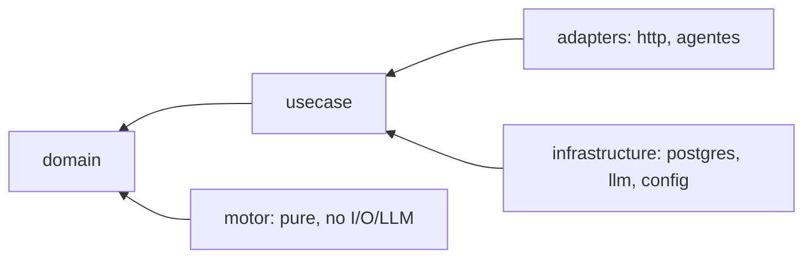

# Design: Issue #1 — Repository Foundation

## Technical Approach
Create the literal, compile-safe scaffold specified by Issue #1. `go.mod` declares Go 1.24 with no dependencies; two `main` packages print fixed placeholders; eight `doc.go` files declare package ownership without imports. This establishes NFR-M-01’s inward boundary while leaving Contract v1.1 and motor behavior untouched. Issue #1’s closed path list prevails over doc 11 §8’s future-only paths.

## Architecture Decisions

| Decision | Rejected alternative | Rationale |
|---|---|---|
| Transcribe Issue #1 exactly | Generate doc 11’s full future tree | Avoids speculative `docs/`, `contracts/`, CI, API, and data artifacts. |
| Standard library only; no `require` block | Add ADK, HTTP, Postgres, lint, or test dependencies | This change is a scaffold, not runtime behavior. |
| Package comments encode boundaries; imports remain empty | Add `go-arch-lint` now | Mechanical enforcement is a later issue; adding tooling exceeds the closed list. |
| Keep `http` and Spanish package names from the issue | Rename for stylistic consistency | Exact acceptance text is authoritative. |

## Intentional Dependency Graph



These are future permitted directions. In this scaffold, internal packages import nothing; each command imports only `fmt` and does not wire internal packages. There is no runtime data flow.

## Exact Makefile Behavior

```makefile
.PHONY: build test vet run datos limpiar

build:
	go build -o bin/servidor ./cmd/servidor
	go build -o bin/pipeline ./cmd/pipeline

test:
	go test ./... -count=1

vet:
	go vet ./...

run:
	go run ./cmd/servidor

datos:
	go run ./cmd/pipeline

limpiar:
	rm -rf bin/
```

Every recipe begins with a literal TAB. Targets accept no parameters: `build` emits two binaries, `test` disables cache, `vet` scans all packages, `run`/`datos` execute placeholders, and `limpiar` removes only root `bin/`.

## File Changes

| File | Action | Purpose |
|---|---|---|
| `go.mod` | Create | Exact module path and `go 1.24`. |
| `Makefile` | Create | Exact six-target lifecycle above. |
| `cmd/servidor/main.go` | Create | `fmt`-only server placeholder. |
| `cmd/pipeline/main.go` | Create | `fmt`-only pipeline placeholder. |
| `internal/domain/doc.go` | Create | Pure domain boundary. |
| `internal/domain/motor/doc.go` | Create | Deterministic, I/O-free motor boundary. |
| `internal/usecase/doc.go` | Create | Use cases and inward ports. |
| `internal/adapters/http/doc.go` | Create | HTTP delivery boundary only. |
| `internal/adapters/agentes/doc.go` | Create | Future ADK wiring boundary only. |
| `internal/infrastructure/postgres/doc.go` | Create | Future repository implementation boundary. |
| `internal/infrastructure/llm/doc.go` | Create | Future provider implementation boundary. |
| `internal/infrastructure/config/doc.go` | Create | Future 12-factor config boundary. |
| `web/.gitkeep` | Create | Track empty web root. |
| `data/.gitkeep` | Create | Track empty data root. |
| `references/.gitkeep` | Create | Track empty references root. |
| `migrations/.gitkeep` | Create | Track empty migrations root. |
| `skills/.gitkeep` | Create | Track empty skills root. |
| `.gitignore` | Modify | Append final `# Binarios compilados` / `bin/` block. |

No implementation file is deleted.

## Phased Implementation
1. Create module, commands, package docs, and five placeholders with exact bytes.
2. Add the Makefile and append (never rewrite) `.gitignore`.
3. Validate paths, package builds, targets, stdout, ignore behavior, and prohibited-path diffs.

## Validation and Rollback
Run `go build ./...`, `go vet ./...`, `make build`, `ls bin/servidor bin/pipeline`, both `go run` commands, `make test`, and `make limpiar`. Confirm exact stdout, `git check-ignore bin/servidor`, no extra Issue #1 paths, and zero `Docs/`/`README.md` diff. The installed Go 1.23.4 is below the required 1.24, so apply/verify must use Go 1.24+; never downgrade `go.mod`.

Rollback is additive: before merge, discard only the enumerated paths and appended ignore block; after merge, revert the foundation commit and remove `bin/`. No migration or feature flag exists.

## Threat Matrix

| Boundary | Applicability |
|---|---|
| Documentation-like paths | N/A — no file classifier or execution discovery. |
| Git repository selection | N/A — no Git subprocess is implemented. |
| Commit state | N/A — no staging/commit automation. |
| Push state | N/A — no push automation. |
| PR commands | N/A — delivery names a PR but adds no PR command integration. |

## Scope Guardrails / Open Question
`Docs/` and `README.md` remain byte-identical. Do not add APIs, schemas, migrations, frontend code, CI, third-party modules, tests, or doc 11-only directories. Before apply, the orchestrator still needs the recorded delivery-size decision: split tooling artifacts or authorize `size:exception` for the consolidated PR.
