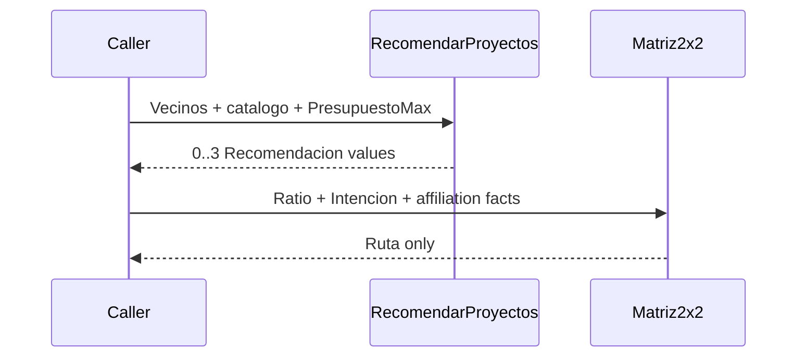

# Design: Recommendations and 2x2 Routing — Issue #10

## Technical Approach

Add two independent pure functions in `internal/domain/motor`. `RecomendarProyectos` transforms Issue #9 value-only `Vecino` evidence plus a canonical project catalog and caller-supplied `PresupuestoMax` into at most three `domain.Recomendacion` values. `Matriz2x2` receives the authoritative capacity `Ratio` and routing facts from its caller and returns only `domain.Ruta`. Contract v1.1 supplies ratio semantics (best affordable catalog project); Doc 13 §§4–5 supplies recommendation and routing rules. Neither function computes capacity or mutates inputs.

**Issue #8 gate:** planning may complete, but apply and verify MUST remain blocked until a maintainer records the Issue #8 merge SHA, that SHA is reachable from `main`, and the Issue #10 worktree descends from that `main`. Do not inspect an Issue #8 branch or its files to satisfy the gate.

## Architecture Decisions

| Decision | Alternatives / tradeoff | Choice and rationale |
|---|---|---|
| Pure motor boundaries | Mutating `Lead`/`Ficha` reduces caller steps but couples orchestration | Two value-in/value-out functions preserve the existing pure motor pattern and route-only scope. |
| Exact eligibility | Floating division is shorter but drifts at boundaries | Require `precio > 0`, `presupuesto >= 0`, then compare `presupuesto >= precio-precio/5` (`ceil(0.8*precio)`) without multiplication, overflow, or division by zero. |
| Deterministic ranking | Float rates or stable input order can collapse/change ties | Rank count descending; compare desistimiento fractions exactly with 128-bit products from `math/bits.Mul64`; finish with canonical `ProyectoID` ascending. Compute float rate only for output display. |
| Matrix precedence | Recomputing capacity or returning milestones leaks scope | Validate the passed ratio, apply non-affiliate conversion preference first, then affiliate 0.95 quadrants/non-affiliate 1.05 advisor gate. `ALTA` alone is high intention. |

## Data Flow



Recommendation aggregation uses exact, non-empty `ProyectoID` map keys. Missing catalog IDs, mismatched catalog-entry IDs, invalid prices, negative budget, and zero-contributor projects are excluded. Empty/no-match output is a non-nil slice. No `K` parameter is added: upstream `K <= 0` is represented by `GemeloKNN` returning non-nil empty `vecinos`, which this function preserves as empty. Catalog metadata is copied unchanged; no display-name merge occurs.

## File Changes

| File | Action | Description |
|---|---|---|
| `internal/domain/motor/recomendar.go` | Create | Pure aggregation, exact eligibility/fraction ordering, card construction, top-three truncation. |
| `internal/domain/motor/matriz.go` | Create | Pure route decision with finite-ratio guard and conversion precedence. |
| `internal/domain/motor/recomendar_test.go` | Create | Table-driven REC, boundary, ordering, and purity tests. |
| `internal/domain/motor/matriz_test.go` | Create | Table-driven MAT, threshold, invalid-input, precedence, and purity tests. |

No production file is modified or deleted.

## Interfaces / Contracts

```go
func RecomendarProyectos(vecinos []Vecino, catalogo map[string]domain.Proyecto, presupuesto int64) []domain.Recomendacion

type EntradaMatriz struct {
    Ratio          float64
    Intencion      domain.Nivel
    EsAfiliado     bool
    RutaConversion bool
}
func Matriz2x2(EntradaMatriz) domain.Ruta
```

For a finite non-negative ratio, affiliates use the four quadrants: high capacity (`>=0.95`)/high intention → `ASESOR`; high/low → `REMARKETING`; low/high → `NUTRICION`; low/low → `DESPEDIDA`. Non-affiliates with `ALTA` use `NUTRICION` when conversion is available (even at `>=1.05`), otherwise `ASESOR` only at `>=1.05` and `NUTRICION` below it. Non-affiliate low intention returns `DESPEDIDA`. NaN, infinity, negative ratio, `MEDIA`, unknown, and empty intention cannot reach `ASESOR`.

## Testing Strategy

| Layer | Coverage | Approach |
|---|---|---|
| Unit | REC-1..3; exact 0.8 peso boundary; invalid money/IDs; aggregation; max 3; shuffled determinism; input immutability | Table-driven tests; directly exercise the exact fraction comparator with near-`uint64` products to prove overflow-safe order/equality. |
| Unit | MAT-1..7; 0.95/1.05 edges; all quadrants; conversion precedence; `MEDIA`; NaN/Inf/negative; route-only purity | Table-driven `Matriz2x2` tests. |
| Package | Regression and coverage | `go test ./internal/domain/motor/...`, `go test ./internal/domain/motor/... -cover` (target ≥90%), then `go build ./...`. |
| Integration/E2E | N/A | No adapter, persistence, LLM, HTTP, or orchestration boundary. |

## Threat Matrix

| Boundary | Applicability | Reason |
|---|---|---|
| Documentation-like paths | N/A | No path classification or execution. |
| Git repository selection | N/A | No Git invocation. |
| Commit state | N/A | No index/worktree behavior. |
| Push state | N/A | No remote/ref behavior. |
| PR commands | N/A | No command composition. |

This is in-memory business routing, not shell/process routing; no threat-matrix RED tests apply.

## Migration / Rollout

No migration required. The four files are additive and initially unwired; rollback deletes or reverts them. No feature flag or data repair is needed.

## Open Questions

None. The spec may refine wording but must preserve these frozen decisions and the Issue #8 gate.
