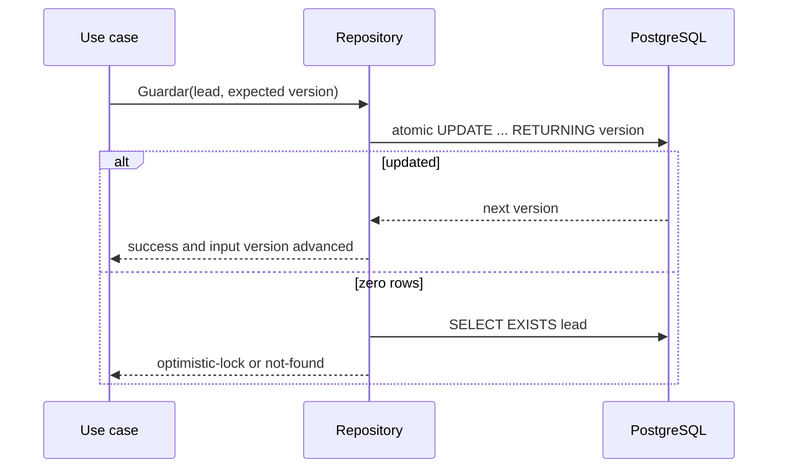

# Design: PostgreSQL Repositories and ULID ID Generator

## Technical Approach

Add resource-specific adapters over `*pgxpool.Pool`, an eager file cache, and ULID generation. Implement only Issue #11 ports and Contract v1.1 schema; domain/usecase contracts, migrations, data, `Docs/`, adapters, and composition-root wiring stay unchanged. The issue sketch is supplementary.

## Architecture Decisions

| Decision | Choice and rationale | Rejected alternative |
|---|---|---|
| SQL boundary | One explicit repository per resource keeps CAS, ordering, joins, and uniqueness auditable. | Generic/reflection CRUD. |
| Shared helpers | Unexported `jsonb.go` preserves SQL `NULL`; `errors.go` maps no-rows and classifies constraints while retaining causes. | Duplicated helpers or flattened errors. |
| Lead CAS | `UPDATE leads SET …, version=version+1 WHERE lead_id=$1 AND version=$expected RETURNING version`; on zero rows, `SELECT EXISTS(SELECT 1 FROM leads WHERE lead_id=$1)` selects optimistic-lock versus not-found. Advance input version only after success. | Upsert or race-prone pre-read. |
| Plans/hitos | Short transactions update a plan and upsert supplied hitos by ID while retaining omitted hitos. Authority defines no replacement semantics, so this is least destructive. No plan CAS/version. | Delete/reinsert or speculative CAS. |
| Ficha | `INSERT … ON CONFLICT (lead_id) DO UPDATE SET ficha_id, contenido, generada_en`; reads distinguish missing lead from unavailable ficha. | Ficha-ID upsert permitting duplicate lead fichas. |
| Catalog | `NuevoCatalogo(fs.FS)` eagerly loads the three JSON files and `brochures/*.md`, validating shapes, duplicate IDs, and brochure identity. Asset errors fail construction; misses are typed not-found; all results are copied. | Lazy loads, working-directory paths, Postgres, or cache aliases. |
| IDs | Pin `github.com/oklog/ulid/v2 v2.1.1`; guard generator-owned monotonic crypto entropy with a mutex and use UTC. Package-private clock/entropy injection supports deterministic tests. | Global entropy, timestamp IDs, or unpinned code. |

## Resource SQL and Data Flow

| Resource | SQL invariants |
|---|---|
| Lead | `INSERT leads`; `SELECT … WHERE lead_id=$1`; CAS above; queue uses `WHERE ($1::bool IS NULL OR afiliado=$1) AND ($2::text IS NULL OR ruta=$2) ORDER BY prioridad DESC, lead_id ASC`. Messages use `INSERT mensajes`; conversation first proves lead existence, then `ORDER BY creado_en ASC, mensaje_id ASC`. |
| Plan | Transactional `INSERT/UPDATE planes` plus `INSERT hitos … ON CONFLICT (hito_id) DO UPDATE`; `PorLead` reconstructs hitos ordered by `fecha,hito_id`; overdue query joins active plans to pending hitos with `fecha <= $1::date ORDER BY fecha,hito_id`; `MarcarHito` checks affected rows. |
| Ficha | Lead-ID upsert above; `SELECT contenido FROM fichas WHERE lead_id=$1`. |

## File Changes

| File | Action | Purpose |
|---|---|---|
| `internal/infrastructure/postgres/jsonb.go` | Create | Nullable/required JSON helpers. |
| `internal/infrastructure/postgres/errors.go` | Create | Shared pgx error mapping. |
| `internal/infrastructure/postgres/lead_repository.go` | Create | Lead/message SQL. |
| `internal/infrastructure/postgres/lead_repository_test.go` | Create | Lead unit/integration scenarios. |
| `internal/infrastructure/postgres/plan_repository.go` | Create | Plan/hito transactions and queries. |
| `internal/infrastructure/postgres/plan_repository_test.go` | Create | Merge, rollback, overdue tests. |
| `internal/infrastructure/postgres/ficha_repository.go` | Create | Lead-keyed ficha upsert/read. |
| `internal/infrastructure/postgres/ficha_repository_test.go` | Create | Upsert and absence tests. |
| `internal/infrastructure/postgres/catalogo_repository.go` | Create | Eager immutable catalog cache. |
| `internal/infrastructure/postgres/catalogo_repository_test.go` | Create | `t.TempDir` load/error/copy tests. |
| `internal/infrastructure/postgres/testdb_test.go` | Create | Environment-gated PostgreSQL harness. |
| `internal/infrastructure/ids/ulid.go` | Create | Safe generator. |
| `internal/infrastructure/ids/ulid_test.go` | Create | Parseability, ordering, concurrent uniqueness. |
| `go.mod` | Modify | Exact ULID requirement only. |
| `go.sum` | Modify | Module checksums. |

No files are deleted.

## Testing Strategy

Table-driven unit tests cover JSON null/nesting, catalog failures and defensive copies, and ULID concurrency. PostgreSQL tests skip when `testing.Short()` or `VIVI_TEST_DATABASE_URL` is absent; against a dedicated database they prove CAS disambiguation/no mutation, conjunctive queue order, chronological ties, transaction rollback, non-destructive plan merge, overdue order, hito absence, and ficha upsert/absence. Each PR runs focused packages, then `go test ./...` and `go build ./...`; no E2E is added because wiring is out of scope.

## Threat Matrix

N/A — no routing, shell, subprocess, VCS automation, executable classification, or process-integration boundary.

## Rollout and PR Boundaries

No migration or feature flag. Deliver three sequential PRs to `main`, merging each before the next and holding authored additions+deletions below 400: (1) helpers + ULID + leads, target 360; (2) plans + fichas, target 380; (3) catalog + integration harness, target 330. Tests ship with each behavior; rollback reverts only that PR. Composition-root activation remains a later issue.

## Open Questions

None. The non-deleting plan merge is an explicit narrow decision and must be locked by tests.
