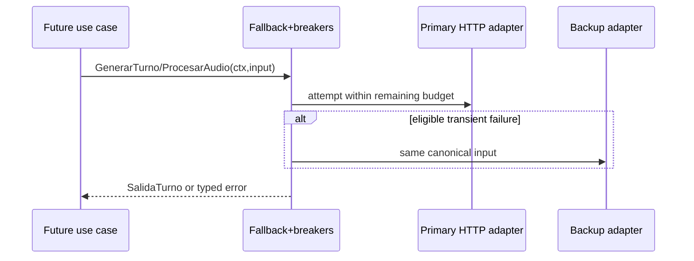

# Design: LLM Provider Adapters and Fallback

## Technical Approach

Add provider adapters in `internal/infrastructure/llm` using `net/http` and an injected `HTTPDoer`; add no SDK or module dependency. Adapters implement the existing `usecase.LLMProvider`, consume the existing `config.Config`, and keep vendor DTOs private. A shared prompt builder and strict parser map both wire protocols to `usecase.SalidaTurno`.

## Architecture Decisions

| Topic | Choice and rationale | Rejected |
|---|---|---|
| Boundary | Strategy adapters plus config factory; `LLMProvider` and `Config` remain byte-for-byte API compatible. | SDK/ADK types crossing into usecase; new env fields. |
| Transport | Inject `HTTPDoer`; production uses `http.Client`. Exact requests, cancellation, and call counts remain testable without live APIs. | Provider SDKs and global clients. |
| Output | One provider-neutral strict parser; vendor response extraction occurs first. This prevents divergent Contract §7 validation. | Per-provider validation. |
| Safety | Harden/delimit prompts now; defer full input/output guardrail and metrics decorators to the conversation use case while retaining composable `LLMProvider` wrappers. | Logging or policy inside wire adapters. |

## Package and File Boundaries

| File | Action | Responsibility |
|---|---|---|
| `llm/errors.go` | Create | Sanitized `ProviderError` and kinds: config, capability, canceled, timeout, rate-limit, unavailable, HTTP, malformed, invalid-output, circuit-open. |
| `llm/prompt.go`, `llm/parser.go` | Create | Canonical prompt; strict `SalidaTurno` decode/validation. |
| `llm/transport.go` | Create | `HTTPDoer`, request execution, 8-second attempt cap. |
| `llm/gemini.go`, `llm/qwen.go` | Create | Private wire DTOs and adapters. |
| `llm/fallback.go`, `llm/breaker.go`, `llm/factory.go` | Create | Eligibility, per-provider breaker, configured composition. |
| `llm/{prompt,parser,gemini,qwen,resilience,factory}_test.go` | Create | Table/HTTP/fake-clock tests. |
| `cmd/servidor/main.go` | Modify | Construct provider; report `Nombre()` and breaker state. |

No files are deleted. `puertos.go`, `config.go`, `go.mod`, and `ci.yml` stay unchanged; CI run `30168602827` passed `main` at `43907ec`, so no toolchain work is planned.

## Prompt and Wire Contracts

Prompt sections are fixed: role/schema, profile, motor numbers, recent history, current user data. Map keys are lexicographically sorted; history is ordered by `CreadoEn`, then `MensajeID`; user text is delimited as data. Gemini POSTs to `.../v1beta/models/{model}:generateContent` with `x-goog-api-key`, `systemInstruction`, and `contents[].parts`. Text uses `{text}`; audio appends `{inlineData:{mimeType,data}}` after context text. `generationConfig.responseMimeType` is `application/json`. Qwen POSTs `{base}/chat/completions` with Bearer auth and OpenAI-compatible `model`, ordered system/user `messages`, and `response_format:{type:"json_object"}`. Gemini extracts ordered text parts from candidate 0; Qwen extracts choice 0 content.

The parser uses `DisallowUnknownFields`, requires EOF, recognized profile keys, sources `DECLARADO|INFERIDO`, confidence `[0,1]`, valid `Nivel`, and the seven actions. Error strings/log fields never include keys, prompts, audio, messages, or response bodies.

## Runtime Flow and Resilience

Each attempt uses the earlier of caller deadline and 8 seconds; the composite caps the logical operation at 10 seconds and gives fallback only the remainder. Caller cancellation stops immediately. Fallback is eligible only for transport I/O, provider timeout, HTTP `408`, `429`, `500`, `502`, `503`, `504`, circuit-open, or malformed JSON after exactly one same-provider format-repair retry. Config/auth/request errors, valid-JSON Contract violations, and capability errors never fall back. Qwen audio returns capability error before HTTP and never routes to Gemini. Exhaustion returns a typed error; the courtesy message belongs to the future use case.

A provider breaker counts one eligible failed logical attempt, resets on success, opens after three consecutive failures for 60 seconds, then admits one half-open probe; concurrent requests bypass an open/half-open provider to fallback. Canceled, config, capability, and validation errors do not count. Clock and state snapshot are injected/testable.

## Testing, Delivery, and Rollback

Use table-driven parser/prompt tests, `httptest.Server` for exact headers/bodies/status mapping, fake `RoundTripper` for cancellation, and fake clock for breaker transitions. Assert request counts, Qwen-audio zero calls, no sensitive error/log text, and no live API or secret use.

Three chained slices: (1) errors/prompt/parser/tests, target ≤300 lines; (2) Gemini/Qwen adapters/tests, ≤400; (3) factory/fallback/breaker/wiring/tests, ≤400. Each slice includes focused `go test`; revert its merge commit in reverse order. Reverting slice 3 restores unwired runtime behavior; no data migration exists.

## Threat Matrix

N/A — no documentation execution, shell/subprocess, Git, push, or PR-command boundary; provider routing is in-process typed composition.

## Open Questions

None.

## Bounded Remediation Slice 7 Decisions

- **Bare monetary context:** contextual bare amounts are paired only with a nearby monetary keyword within three lexical words, with no intervening numeric token and no sentence/clause punctuation. This replaces the former 64-character window so a monetary phrase cannot authorize a distant count or date.
- **Exact Colombian normalization:** grouped integers and Colombian comma decimals are parsed as digit strings. Fractional pesos are rejected because `NUMEROS_DEL_MOTOR` is integer-valued; `,00` remains valid. Million expressions scale decimal digits with integer arithmetic and overflow checks; no floating-point rounding is used.
- **Default limiter posture:** each provider uses a bounded token bucket with a burst of 3 and a refill of 0.5 tokens/second by default. The burst supports a short conversational burst while the 30-second token interval remains conservative for provider APIs. These are named internal defaults, not new configuration or contractual limits.
- **Breaker sequence:** an ineligible failure clears the eligible-failure counter, matching the existing success reset. Opening therefore requires exactly three consecutive eligible failures.
