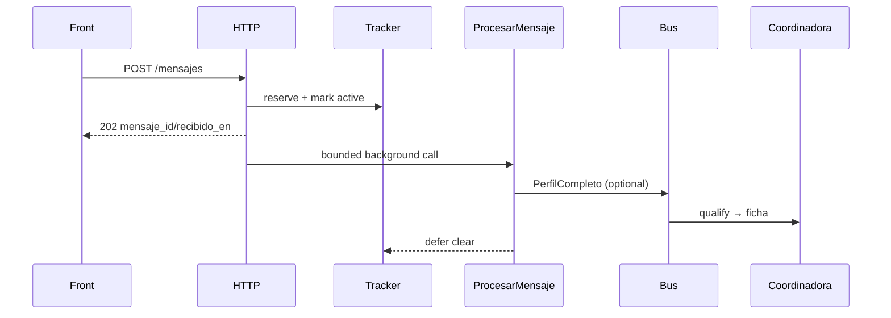
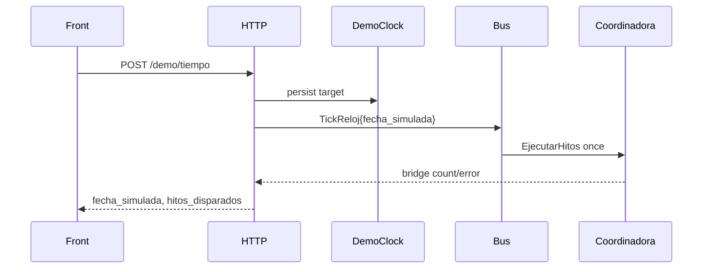

# Design: Contract v1.1 HTTP API and Demo Controls

## Technical Approach

Add a thin `net/http` adapter and composition root over Issues #18–#22. `Controlador` decodes strict Contract §3 JSON, delegates to narrow application interfaces, and presents DTOs/errors; handlers contain no motor, SQL, aggregation, or lifecycle policy. Queue/detail, buyer-persona, demo clock/reset, and async-turn orchestration are new application boundaries. **ADK is excluded**: the existing plain-Go bus, coordinator, and use cases are wired directly. Domain types, motor formulas, Contract v1.1, and existing #18–#22 behavior remain unchanged.

## Architecture Decisions

| Concern | Choice / rationale | Rejected |
|---|---|---|
| Construction | `NuevoControlador(Dependencias)` validates narrow interfaces; `Registrar(*http.ServeMux)` exposes Go method patterns. `main.go` constructs Postgres, catalog, IDs, clock, bus, coordinator, use cases, controller only inside `=== BLOQUE A ===`. Tests inject fakes without config/Postgres. | Globals; handlers constructing infrastructure. |
| Events | Register `Coordinadora` once with qualifier, documenter, and milestone executor. `PerfilarLead` remains the sole `LeadNuevo` producer; a separate deterministic plain-Go `SaludarLead` subscriber persists the initial message, so #22’s coordinator callback remains observe-only and ADK-free. `PerfilCompleto→CalificarLead` and `RutaDecidida(ASESOR)→GenerarFicha` retain #22 ordering. Demo time emits one Contract-shaped `TickReloj`; because the bus is synchronous/context-preserving, HTTP attaches a private result sink and the milestone adapter writes the coordinator’s `EjecutarHitos` count/error into it—never executing twice. The coordinator parser additively accepts canonical `fecha_simulada` while retaining legacy `hasta`. | ADK, duplicate direct calls, async bus. |
| Async turn | `EjecutorTurnos` owns a process-root context, `WaitGroup`, and mutex map keyed by lead ID. Acceptance validates first, reserves server ID/time through an additive optional `EntradaMensaje` seam, marks active, returns 202, then calls existing `ProcesarMensaje` in a bounded goroutine; `defer` clears state. Shutdown cancels/waits. Single-dyno scope is explicit. | Request context, unbounded goroutines, persisted job queue. |
| Read models | `ConsultarLeads` uses repositories, preserves persisted `prioridad`, derives `semaforo/resumen`, counts non-affiliate ASESOR cupo, and adds optional plan/ficha reads. `BuyerPersona` aggregates the immutable catalog snapshot by project and derives stable `actualizado_en` from the newest source `fecha_opcion`; handlers never aggregate. | SQL/business rules in HTTP. |
| Demo state | `AvanzarDemo` first persists `demo.fecha_simulada` through an error-returning `DemoRepository`, then updates the mutex-safe `Reloj` cache and publishes the tick; `EjecutarHitos.Avanzar` is therefore idempotent and `/salud` reads the same cache. Reset is one transaction deleting `fichas→hitos→planes→mensajes→leads`, restoring approved seeds/date, preserving `compradores`, and requiring `DEMO_SEED=true`; a disabled gate makes no mutation and returns generic 500. No migration. | `time.Now`, best-effort writes, DDL/TRUNCATE, deleting catalog data. |
| Errors/privacy | `DisallowUnknownFields`, one JSON value, body/decoded-audio limits, catalog-only status mapping, generic 500/503. Logs contain route, status, opaque `lead_id`, latency; never cédula, phone, text/audio, payload, SQL, provider error, or stack. | `err.Error()` responses/logs. |

## Data Flow

## File Changes

| Slice | Files | Action |
|---|---|---|
| S1 | `internal/adapters/http/{errores,rutas,leads}.go`, `internal/adapters/http/leads_test.go`; `internal/usecase/saludar_lead.go`, `internal/usecase/saludar_lead_test.go`; `cmd/servidor/main.go` | Create; modify main |
| S2 | `internal/adapters/http/{turnos,turnos_test}.go`; `internal/usecase/{procesar_mensaje.go,procesar_mensaje_test.go}` | Create; additive acceptance metadata |
| S3 | `internal/usecase/{consultar_leads,consultar_leads_test}.go`; `internal/adapters/http/{cola,cola_test}.go` | Create |
| S4 | `internal/usecase/{buyer_persona,buyer_persona_test}.go`; `internal/adapters/http/{gerencia,gerencia_test}.go` | Create |
| S5 | `internal/usecase/avanzar_demo.go`, `internal/usecase/avanzar_demo_test.go`, `internal/usecase/puertos.go`; `internal/infrastructure/reloj/postgres.go`, `internal/infrastructure/reloj/postgres_test.go`; `internal/infrastructure/postgres/demo_repository.go`, `internal/infrastructure/postgres/demo_repository_test.go`; `internal/adapters/http/demo.go`, `internal/adapters/http/demo_tiempo_test.go`, `internal/adapters/http/salud.go`; `internal/adapters/agentes/coordinadora.go`, `internal/adapters/agentes/coordinadora_test.go` | Create; modify ports/health/coordinator |
| S6 | `internal/usecase/{reiniciar_demo,reiniciar_demo_test}.go`; `internal/adapters/http/demo_reset_test.go`; `internal/infrastructure/postgres/{demo_repository.go,demo_repository_test.go}` | Create tests/use case; extend repository |

No files are deleted. Each chained slice targets its predecessor, is independently testable/revertible, and is capped at **≤400 authored runtime/test changed lines** (forecasts: 390/320/360/330/370/300).

## Testing, Threat Matrix, and Rollout

`httptest` contract tables cover every route/method, strict JSON, statuses/shapes, async active→clear, cancellation, filters/order, ficha distinction, aggregation, clock/tick count, and reset idempotency/rollback; focused use-case/Postgres tests use fixed clocks and fakes, then `go test ./...`, `go test -race ./...`, and `go build ./...` per slice.

Threat-matrix rows are all **N/A**: documentation-like paths (no execution), Git selection, commit state, push state, and PR commands (no VCS/process automation). HTTP route confusion is nevertheless tested with wrong methods, unknown paths, encoded IDs, and oversized bodies.

No migration or domain data conversion. S6 apply requires maintainer confirmation of seed identities/reset blast radius; multi-dyno deployment requires replacing the in-process tracker before rollout.
