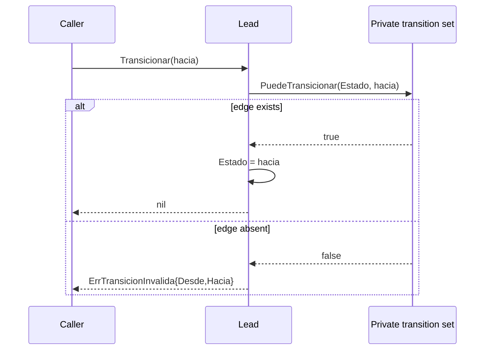

# Design: Lead State Machine (Issue #7)

## Technical Approach

Add a standard-library-only State machine in `internal/domain/estado.go`, around the existing `EstadoLead` constants and `Lead.Estado`. Contract v1.1 §1 supplies the 11 allowed edges; architecture §5 and NFR-M-03.5 require one domain-owned relation and domain errors for every other edge. The JSON schema, enum values, and `Lead` fields remain unchanged.

ADK Go 2.0 is not used because no agent is in scope. No ADK dependency, import, fixture, or adapter will be added; this keeps `internal/domain` compliant with NFR-M-01.

## Architecture Decisions

| Decision | Choice and rationale | Rejected alternatives |
|---|---|---|
| Canonical relation | Define unexported `transiciones map[EstadoLead]map[EstadoLead]struct{}` in `estado.go`. The outer map is adjacency and each inner map is a membership set; it is initialized once and never mutated. This provides one auditable policy and constant-time checks. | Exported maps/slices permit policy corruption and races. Per-state objects duplicate a static nine-state relation and add unnecessary indirection. |
| Deterministic query | Keep a private fixed state-order array. `EstadosPosibles(desde)` filters that order through the destination set into a newly allocated slice on every call. This preserves Contract order and deep-copies the observable result; callers cannot alias canonical state. | Iterating the map is nondeterministic; returning a shared slice leaks mutable policy. |
| Typed rejection | Return the value `ErrTransicionInvalida{Desde, Hacia}` with a value-receiver `Error() string`. Callers can use `errors.As` into an `ErrTransicionInvalida` value while outer adapters may later map it to `TRANSICION_INVALIDA`/409. | A string or sentinel loses transition values; HTTP-shaped errors violate the domain boundary. |
| Guarded mutation | Implement `func (l *Lead) Transicionar(hacia EstadoLead) error` in `estado.go`. It captures `desde`, validates through `PuedeTransicionar`, and assigns only after success. Rejection returns the typed value and leaves `l.Estado` unchanged. The public field remains for Contract/JSON compatibility, but domain callers should use this method as the sole mutation path. | Caller-side validation can drift from mutation and permits partial updates. Hiding the field breaks the existing contract. |

## Data Flow



## File Changes

| File | Action | Description |
|---|---|---|
| `internal/domain/estado.go` | Create | Private map/set, deterministic query, typed error, and guarded `Lead` method. |
| `internal/domain/estado_test.go` | Create | Table-driven lifecycle, error, atomicity, terminal, order, and aliasing tests. |

No files are modified or deleted; specifically, `enums.go` and `lead.go` remain unchanged.

## Interfaces / Contracts

```go
type ErrTransicionInvalida struct { Desde, Hacia EstadoLead }
func PuedeTransicionar(desde, hacia EstadoLead) bool
func EstadosPosibles(desde EstadoLead) []EstadoLead
func (l *Lead) Transicionar(hacia EstadoLead) error
```

## Testing Strategy

| Layer | Coverage | Approach |
|---|---|---|
| Unit | Relation and query | Explicit table of all 11 valid edges; Cartesian product of the nine known states asserts the other 70 pairs are invalid. Table cases also cover zero/unknown source and destination, and empty results for terminal `CERRADO` and `DESPEDIDO`. |
| Unit | Error and mutation | For every invalid pair, use `errors.As`, assert exact `Desde`/`Hacia`, and prove `Lead.Estado` is unchanged; valid cases prove assignment. |
| Unit | Deep-copy/order | Assert expected ordered destinations for each source; mutate a returned `EstadosPosibles` slice and prove a later call remains canonical. |
| Regression | Existing domain contract | Run existing enum wire-value and reflected `Lead` metadata tests unchanged. |

Use `t.Run` table-driven tests. Validate narrowly with `go test ./internal/domain/...`, then `go test ./...`, `go vet ./...`, and `go build ./...`. Integration and E2E tests are N/A for pure, dependency-free domain behavior.

## Threat Matrix

N/A — no routing, shell, subprocess, VCS/PR automation, executable-file classification, or process-integration boundary.

## Migration / Rollout

No migration required. No persisted schema or wire value changes. Rollback deletes the two new files (or reverts their commit).

## Open Questions

None.
