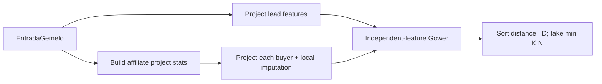

# Design: Buyer-Twin kNN

## Technical Approach

Implement `GemeloKNN` as a pure deterministic service in `internal/domain/motor/knn.go`, governed by Doc 13 §3 and the proposal. It projects a typed lead query and `domain.Comprador` values into private feature vectors, builds project-local affiliate statistics once, computes independent-feature Gower distances, and returns value-only neighbors. Production imports are limited to the standard library and `internal/domain`: no I/O, ADK, LLM, pipeline, database, or Issue #8 capacity dependency.

## Architecture Decisions

| Decision | Choice | Alternatives rejected | Rationale |
|---|---|---|---|
| Boundary | One input struct containing the lead profile, explicit affiliation/dependents, buyer records, keyed catalog zones, and `K` | Parallel feature slices; enriching `Comprador` | Keyed records cannot silently misalign and preserve Contract types. |
| Output | Minimal `Vecino` values: buyer ID, project ID, desistimiento, distance | Pointers or the full buyer | Supports Issue #10 while preventing mutation and accidental dependence on price/name. |
| Statistics | One immutable index keyed by exact `ProyectoID` | Global or cross-project statistics | Enforces same-project provenance and makes lookup O(1). |
| Missingness | Optional lead dependents use `*int`; projected features carry explicit presence | Sentinel zero | Zero is a real dependent count; unavailable dimensions remain independent. |
| Determinism | Stable sort by distance, then buyer ID ascending | Map/input order | Meets byte-reproducible KNN-3 ordering. |

## Data Flow



The statistics pass counts affiliates per exact project, collects valid A/B/C categories and age representatives, then finalizes category mode (ties `A < B < C`) and numeric median (average the two center values). Imputation applies only to a non-affiliate's missing category/age, independently, when its project has at least five affiliates and that statistic exists. Inputs and maps are never mutated.

## File Changes

| File | Action | Description |
|---|---|---|
| `internal/domain/motor/knn.go` | Create | Types, projection, statistics index, Gower, and selection. |
| `internal/domain/motor/knn_test.go` | Create | Exhaustive table-driven behavior and purity tests. |

No existing production file changes; specifically, no Issue #8 `capacidad*.go` edit.

## Interfaces / Contracts

```go
type EntradaGemelo struct {
    Perfil          domain.Perfil
    Afiliado        bool
    PersonasACargo  *int
    Compradores     []domain.Comprador
    ZonasCatalogo   map[string]string // exact ProyectoID -> Zona
    K               int
}
type Vecino struct {
    ID int
    ProyectoID string
    Desistio bool
    Distancia float64
}
func GemeloKNN(in EntradaGemelo) []Vecino
```

`K <= 0` or no buyers returns a non-nil empty slice; otherwise return `min(K,N)`.

## Projection, Normalization, and Gower

Lead category derives from present, non-negative `ingreso_hogar` using SMMLV 2026 (`1,750,905`): `<=2` A, `<=4` B, else C. Lead age comes from positive `edad`; zone from `zona_deseada`; dependents are present when the pointer is non-nil and non-negative. Buyer ages map `20-35→27.5`, `36-45→40.5`, `46-55→50.5`, `55+→60`; empty/`SIN_DATO`/unknown is absent. Historical non-negative dependents, including zero, are present because the current `Comprador` contract has no missingness marker.

Categories accept only normalized A/B/C. Category, age-label, and zone strings are trimmed; internal whitespace is collapsed and comparisons are case-insensitive. Accents/punctuation are not removed. Project IDs are not slugged or inferred: catalog lookup is exact; a miss omits zone. Project name and `ValorCOP` are never read.

Gower uses category `.35`, zone `.20`, age `.15`, affiliation `.15`, dependents `.15`. Each feature participates only when present on both sides; divide by participating weight. Numeric terms are `min(|a-b|/range,1)` with age range `32.5` and dependents range `10`. Affiliation is always present, so the denominator cannot be zero.

## Testing Strategy

| Layer | Coverage |
|---|---|
| Unit | Table-driven KNN-1..5/B-3; exact income thresholds; all age representatives; zone/category normalization; independent omission and renormalization; symmetry, identity, and `[0,1]`; 30-neighbor ordering, ties, `K>N`, `K<=0`, empty input. |
| Statistics | Affiliate-only/same-project/at-least-five rules; below-threshold omission; mode tie; odd/even median; category and age imputed independently. |
| Safety | Deep-equal inputs before/after; unknown project omits zone; changing name/price cannot change results while catalog zone can; deterministic repeated results. |

Run `go test ./internal/domain/motor/...`, `go test ./...`, and `go build ./...`; target at least 90% package coverage. No integration or E2E layer is needed for a pure service.

## Threat Matrix

N/A — no routing, shell, subprocess, VCS/PR automation, executable-file classification, or process-integration boundary.

## Migration / Rollout

No migration required. The two new, initially unwired files can be rolled back by deletion/revert.

## Open Questions

None.
